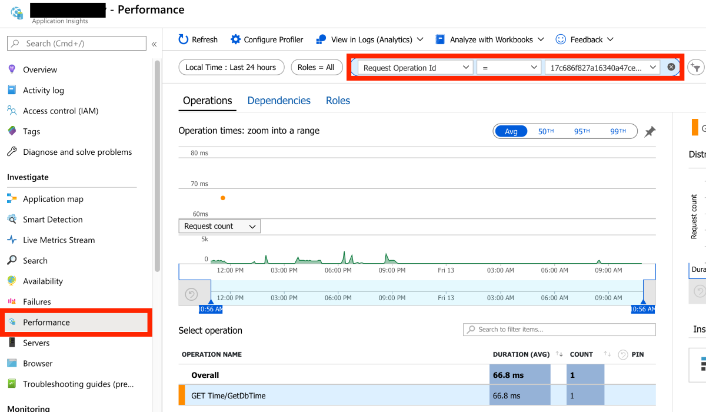
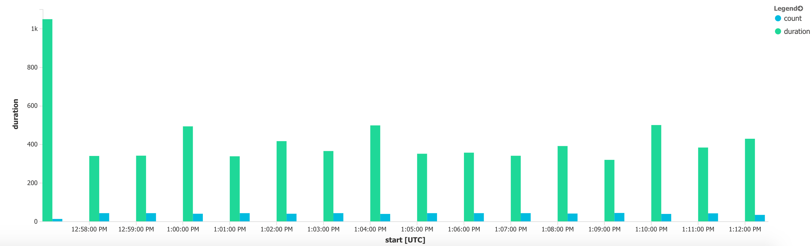

# Application Insights Tips

## 1) Add application information to all telemetry

Use Telemetry Initializer to add shared application information

```c#
internal class CloudRoleTelemetryInitializer : ITelemetryInitializer
{
    private readonly string roleName;
    private readonly string roleInstance;
    private readonly string version;

    public CloudRoleTelemetryInitializer()
    {
        var name = Assembly.GetEntryAssembly().GetName();
        this.roleInstance = Environment.MachineName;
        this.version = name.Version.ToString();

        // To display each version independently on Application Map, add the version to the role name
        this.roleName = name.Name;
    }

    public void Initialize(ITelemetry telemetry)
    {
        telemetry.Context.Cloud.RoleName = roleName;
        telemetry.Context.Cloud.RoleInstance = roleInstance;
        telemetry.Context.GlobalProperties["AppVersion"] = version;
    }
}
```

## 2) Find traces/operations by identifier in Azure Portal

To find end-to-end transactions in Azure Portal go to your Application Insights account, select Performance and enter the filter by `Request Operation Id`:



## 3) Getting the longest end-to-end operation executions

Lists the longest end-to-end transaction times including start, end, depth, total_duration

```kusto
let endTime = (start: datetime, duration: int) { datetime_add("Millisecond", duration, start) };
let startDate = ago(2h);
let operationName = 'GET Main/Enqueue [source]';
requests
| where name == operationName
| where timestamp >= startDate
| project operation_Id
| join kind=leftouter (requests) on $left.operation_Id == $right.operation_Id
| summarize start=min(timestamp), end=max(endTime(timestamp, duration)), depth=dcount(cloud_RoleName) by operation_Id
| project Name=operationName, operation_Id, start, end, depth, total_duration=datetime_diff("Millisecond", end, start)
| order by total_duration desc
```

### Graph of end-to-end operation/durations per minute

Query on operation count/avg duration per minute


```kusto
let endTime = (start: datetime, duration: int) { datetime_add("Millisecond", duration, start) };
let startDate = ago(2h);
let operationName = 'GET Main/Enqueue [source]';
requests
| where name == operationName
| where timestamp >= startDate
| project operation_Id
| join kind=leftouter (requests) on $left.operation_Id == $right.operation_Id
| summarize start=min(timestamp), end=max(endTime(timestamp, duration)) by operation_Id
| summarize duration=avg(datetime_diff("Millisecond", end, start)), count=count(operation_Id) by bin(start, 1min)
| render columnchart kind=unstacked
```

