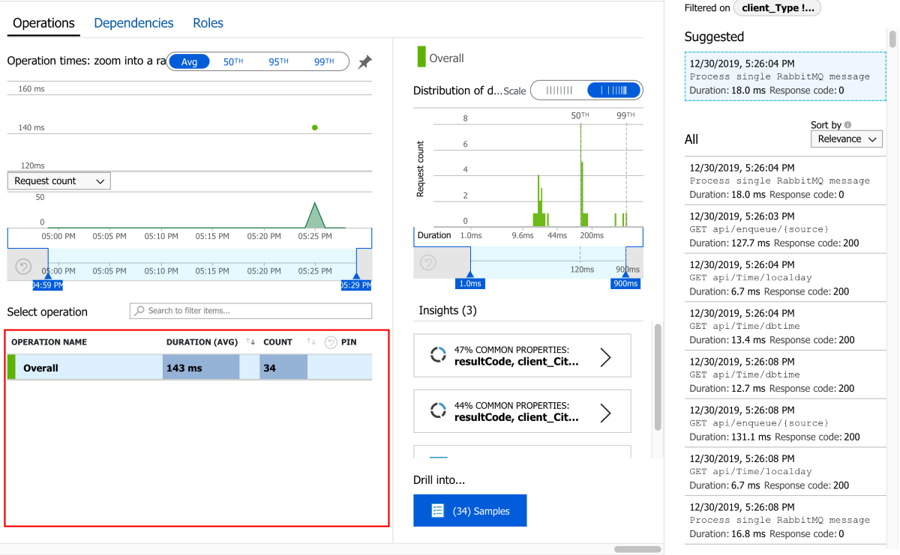
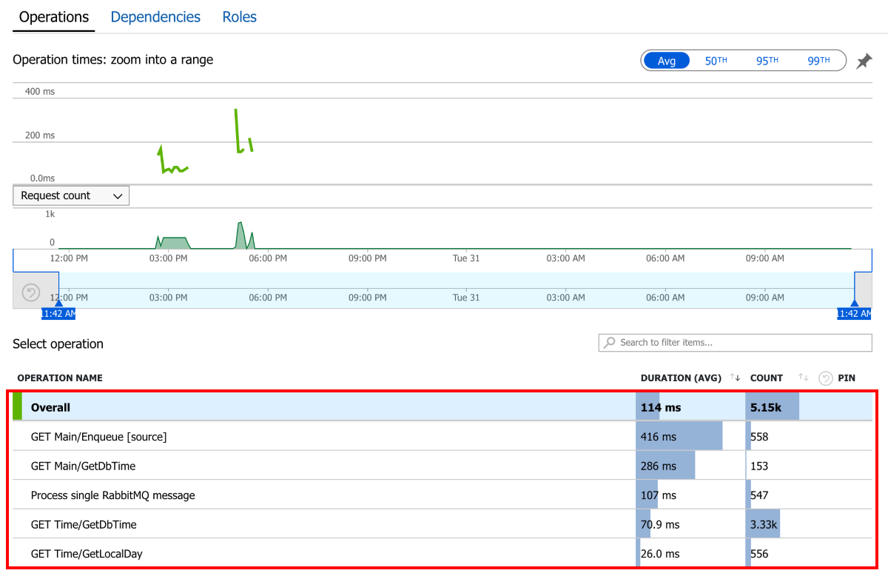
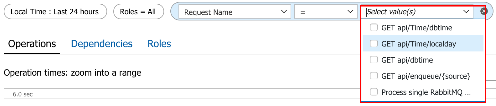
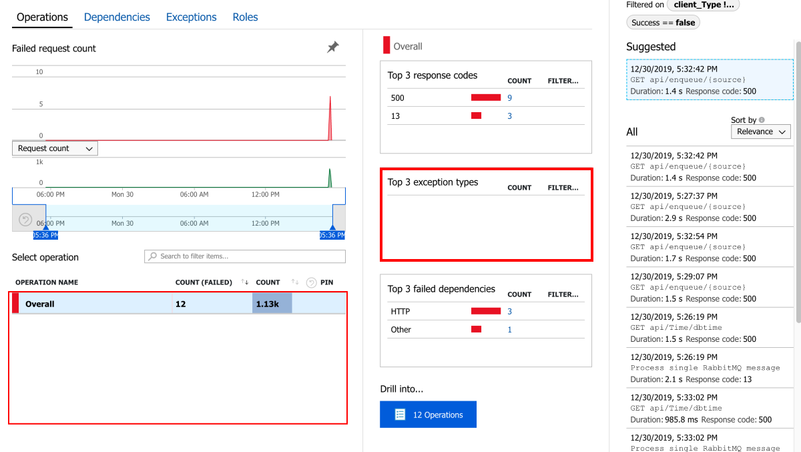
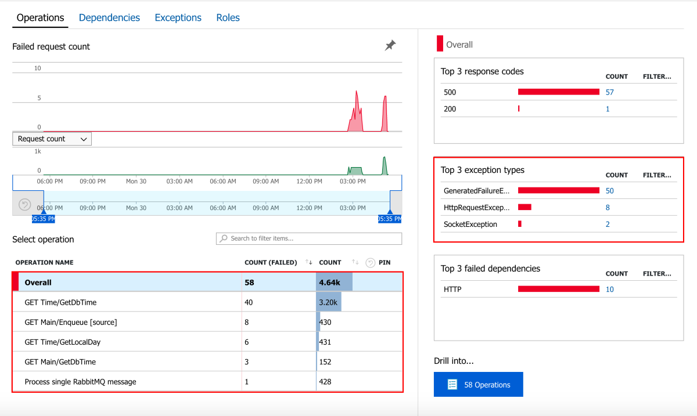
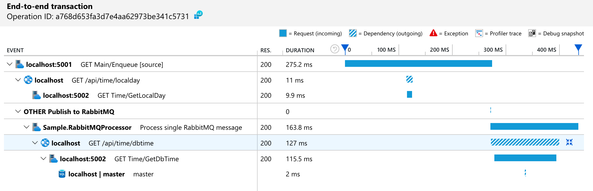
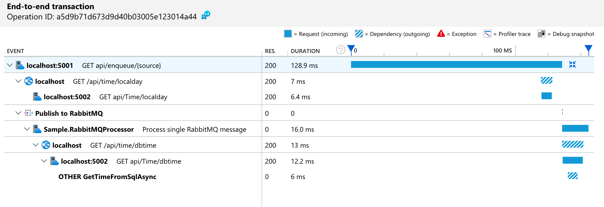
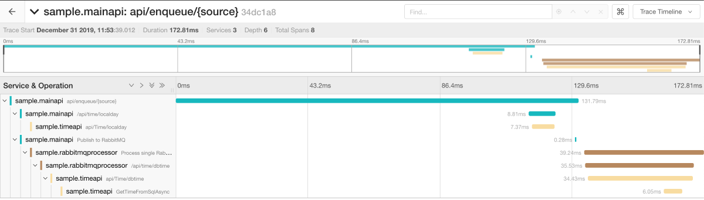
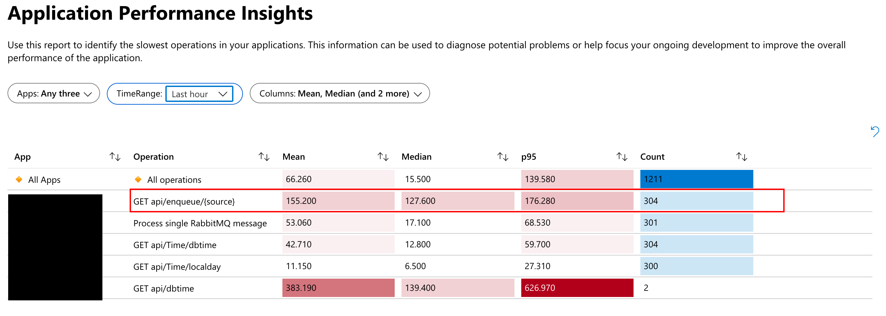
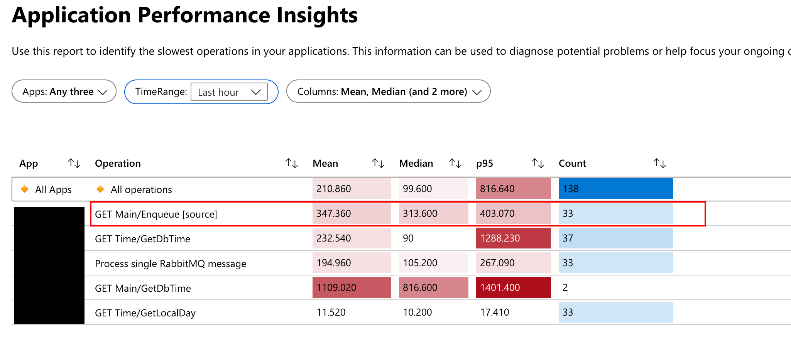

# Using OpenTelemetry with Application Insights

Using Azure Application Insights through OpenTelemetry SDK is an option available to those who wish to keep the code base flexible by depending on a standard API. It is important to notice the following differences when using it OpenTelemetry instead of the Application Insights SDK:

## 1. Live metrics stream is not supported

At least out of the box, live metrics stream won't work.

## 2. Nameless operations

In `Performances` operations don't have a name and are all grouped as 1 item. Going to details let's you differentiate them.

No operation name using OpenTelemetry SDK:

Operation name exists using Application Insights SDK:

Using OpenTelemetry, the granularity is exposed as request name.

## 3. Failures: nameless and missing exception type

The same happens in `Failures`, all operations are grouped into 1 item. Moreover, the exception type is not available
Using OpenTelemetry SDK:

Using AI SDK:

## 4. Differences in creating span from System.Diagnostics.Activity

When creating spans/operations from a System.Diagnostics.Activity, OpenTelemetry has 2 differences in comparison to Application Insights (between methods Tracer.StartActiveSpanFromActivity and TelemetryClient.StartOperation<RequestTelemetry>).

- OpenTelemetry won't automatically copy Activity.Tags
- OpenTelemetry requires the activity to have been started (Activity.Start())

## ~~5. Difference in first request duration~~

~~When building traces for asynchronous transactions (publisher/consumer) the starting request duration is different depending on the SDK used.~~

~~With Application Insights SDK the request duration seems to be the total time. On the other hand, using OpenTelemetry SDK, it seems to have only the self time.~~

~~Application Insights SDK:~~

~~Open Telemetry SDK:~~

~~When using the Jaeger exporter the starting request has the self time as duration (as with OpenTelemetry + Application Insights exporter):~~

~~This difference is also visible in Application Insights/Workbooks/Application Performance Insights.~~

~~OpenTelemetry SDK has only the self time:~~

~~Application Insights SDK has the total time:~~

~~For me, the ideal solution would be:~~

~~- Allow visualization and alerting on end-to-end transaction duration (total time)~~
~~- Include self time of requests starting an asynchronous trace~~

