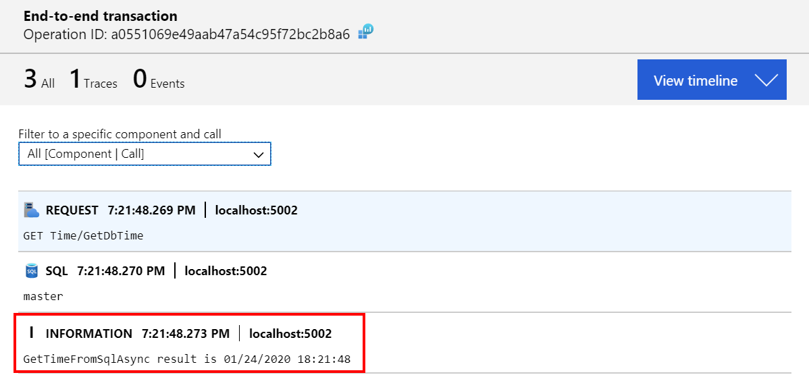

# Scenario 1: REST API accessing SQL Server

REST API with dependency on SQL Server.


## Observability requirements

In order to fulfill the observability requirements for this scenario the following information should be collected:

1. Duration of API requests
2. Duration of SQL operations
3. Log information containing SQL Server response

## Implementation

Both OpenTelemetry and Application Insights SDK offer out-of-the-box support for http requests collection. At the time of writing, only Application Insights supported SQL Server tracing collection (pending PR with SQL collector is found [here](https://github.com/open-telemetry/opentelemetry-dotnet/pull/355)). A simple way to add SQL Server tracing using Open Telemetry is to create the spans before calling SQL Server:

```C#
var span = this.tracer.StartSpan(nameof(GetTimeFromSqlAsync), SpanKind.Client);
try
{
  
    return await this.repository.GetTimeFromSqlAsync();
}
catch (Exception ex)
{
    span.Status = Status.Internal.WithDescription(ex.ToString());
    throw;
}
finally
{
    span.End();
}
```

Recapping: besides the custom SQL dependency tracking needed for OpenTelemetry **no custom code (besides SDK bootstrapping) is required**.

## Requirement validation

### 1. Duration of API requests

In Jaeger UI, traces can be filtered by service and operation, displaying an overview:


In application insights this is available under Performance:


### 2. Duration of SQL operations

In Jaeger, clicking on a trace display details it, including the SQL call duration:


In application insights we can view as dependencies:


Or as part of the end to end transaction:


### 3. Log information containing SQL Server response

As the sample application is using Application Insights as logging provider the screenshot below shows how the log can be scoped to the end to end transaction.



This is powerful! If you have distinct system taking care of tracing and logging finding logs for a trace won't be so simple.

## Running this scenario

In order to run this scenario locally ensure that following requirements are met:

- SQL Server is available at `server=localhost;user id=sa;password=Pass@Word1;`<br/>
A way to accomplish it is to run as a linux docker container:

```bash
docker run --name sqlserver -e "ACCEPT_EULA=Y" -e "SA_PASSWORD=Pass@Word1" -p 1433:1433 -d mcr.microsoft.com/mssql/server:2019-GA-ubuntu-16.04
```

- When using OpenTelemetry, ensure Jaeger is running locally

```bash
docker run -d --name jaeger \
        -e COLLECTOR_ZIPKIN_HTTP_PORT=9411 \
        -p 5775:5775/udp \
        -p 6831:6831/udp \
        -p 6832:6832/udp \
        -p 5778:5778 \
        -p 16686:16686 \
        -p 14268:14268 \
        -p 9411:9411 \
        jaegertracing/all-in-one
```

- When using Application Insights (set USE_APPLICATIONINSIGHTS=1 and USE_OPENTELEMETRY=0), ensure the instrumentation key is set (APPINSIGHTS_INSTRUMENTATIONKEY). The sample project has a simple way to provide settings to all applications. In folder ./shared create a file called `appsettings.Development.json`.

To run the sample start the project Sample.TimeApi. To generate load use the following script:

```bash
watch -n 1 curl --request  GET http://localhost:5002/api/time/dbtime
```
