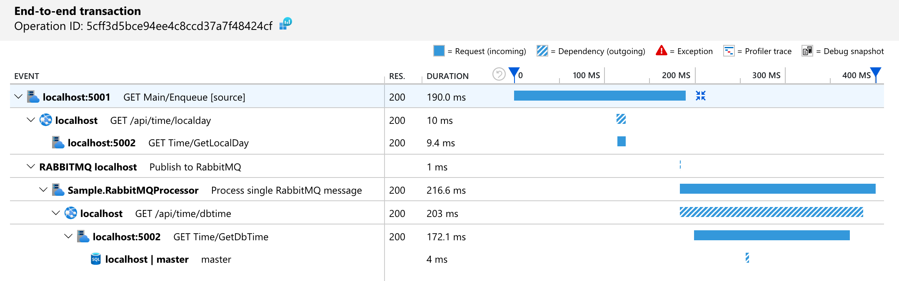
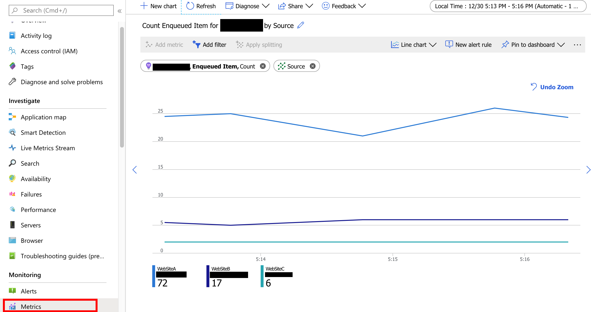

# Scenario 3: Asynchronous transactions

This scenario covers asynchronous transactions using RabbitMQ queues. In this scenario, propagating correlated trace is our responsibility.


## Observability requirements

1. Include all services as part of the trace
2. Include RabbitMQ publishing activity
3. Have metrics aggregating enqueued items by source

## Implementation

In order to correlate the publisher and consumer of a RabbitMQ message we need have to add the traceability ourselves. There is no built-in traceability as with HTTP requests in .NET Core 3.0. The sample application uses RabbitMQ message headers to include the trace parent of each message. Similar to the way Azure Service Bus does.

In the sample application, the publisher starts a System.Diagnostics.Activity before publishing a message to RabbitMQ. The full id (W3C format) is forwarded in the message header:

```c#
Activity activity = null;
if (diagnosticSource.IsEnabled(Constants.DiagnosticsName))
{
    activity = new Activity(Constants.PublishActivityName);
    // code removed for simplicity
    diagnosticSource.StartActivity(activity, null);

    basicProperties.Headers.Add("traceparent", activity.Id);
}

channel.BasicPublish(...)
```

In consumer, the trace parent is extracted from the message header and used when creating the consumer Activity.

```c#
public static Activity ExtractActivity(this BasicDeliverEventArgs source, string name)
{
    var activity = new Activity(name);

    if (source.BasicProperties.Headers.TryGetValue("traceparent", out var rawTraceParent) && rawTraceParent is byte[] binRawTraceParent)
    {
        activity.SetParentId(Encoding.UTF8.GetString(binRawTraceParent));
    }

    return activity;
}
```

The created Activities won't be added to exported to OpenTelemetry or Application Insights by themselves. We have two options to export them.

### Using the Activity directly

In this approach the final span/operation is created from an Activity. This is how the consumer sample application was built.

Activity extracting:

```c#
// ExtractActivity creates the Activity setting the parent based on the RabbitMQ "traceparent" header
var activity = rabbitMQMessage.ExtractActivity("Process single RabbitMQ message");
```

OpenTelemetry:

```c#
activity.Start();
tracer.StartActiveSpanFromActivity(activity.OperationName, activity, SpanKind.Consumer, out span);
```

Application Insights:

```c#
var operation = telemetryClient.StartOperation<RequestTelemetry>(activity);
```

### Using Diagnostic Listeners

Another way to consume generated Activities is to subscribe to them, creating the the corresponding span (or dependency in Application Insights).

The sample publisher (Sample.MainApi) contains a simplified collector implementation for Application Insights and OpenTelemetry (Sample.RabbitMQCollector project). For production quality please refer to OpenTelemetry and/or Application Insights built-in collectors and this [user guide](https://github.com/dotnet/corefx/blob/master/src/System.Diagnostics.DiagnosticSource/src/ActivityUserGuide.md).

For OpenTelemetry, this is how it looks like:

```C#
public class RabbitMQListener : ListenerHandler
{
    public override void OnStartActivity(Activity activity, object payload)
    {
        var span = this.Tracer.StartSpanFromActivity(activity.OperationName, activity);
            foreach (var kv in activity.Tags)
                span.SetAttribute(kv.Key, kv.Value);
    }

    public override void OnStopActivity(Activity activity, object payload)
    {
        var span = this.Tracer.CurrentSpan;
        span.End();
        if (span is IDisposable disposableSpan)
        {
            disposableSpan.Dispose();
        }
    }
}

var subscriber = new DiagnosticSourceSubscriber(new RabbitMQListener("Sample.RabbitMQ", tracer), DefaultFilter);
subscriber.Subscribe();
```

### Metrics requirements implementation

To fulfill metrics requirements using OpenTelemetry, the sample application uses a Prometheus exporter.

```c#
var prometheusExporterOptions = new PrometheusExporterOptions()
{
    Url = "http://+:9184/metrics/",
};

var prometheusExporter = new PrometheusExporter(prometheusExporterOptions);
var simpleProcessor = new UngroupedBatcher(prometheusExporter, TimeSpan.FromSeconds(5));
var meterFactory = MeterFactory.Create(simpleProcessor);
var meter = meterFactory.GetMeter("Sample App");
var counter = meter.CreateInt64Counter("Enqueued Item");

// Calling Start() will start a http handler on http://localhost:9184/metrics/
prometheusExporter.Start();


// Adding to the counter
var context = default(SpanContext);
var labelSet = new Dictionary<string, string>() 
{
    { "Source", source }
};

counter.Add(context, 1L, meter.GetLabelSet(labelSet));
```

Application Insights SDK also provides support to metrics, as the code below demonstrates:

```C#
// Create the metric with custom dimension "Source"
var itemEnqueuedMetric = telemetryClient.GetMetric(new MetricIdentifier("Sample App", "Enqueued Item", "Source"));

// Add items to metric
itemEnqueuedMetric.TrackValue(metricValue, "WebSite");
```

## Requirement validation

### 1. Include all services as part of the trace

In Jaeger UI, all services are part of the trace details:


In Application insights the transaction looks like this:



### 2. Include RabbitMQ publishing activity

As displayed above, the `Publish to RabbitMQ` activity has it's own span, for both Jaeger and Application Insights.

### 3. Have metrics aggregating enqueued items by source

In the sample application, metrics have been implemented with OpenTelemetry (Prometheus exporter) and Application Insights (through the SDK).

The metrics using Prometheus (and Grafana for visualization) looks like this:


The raw metrics are available in [http://localhost:9184/metrics](http://localhost:9184/metrics), as the example below:

```text
# HELP Enqueued_ItemSample AppEnqueued Item
Enqueued_Item{Source="WebSiteB"} 1 1578051759271
# HELP Enqueued_ItemSample AppEnqueued Item
Enqueued_Item{Source="WebSiteC"} 0 1578051759271
# HELP Enqueued_ItemSample AppEnqueued Item
Enqueued_Item{Source="WebSiteA"} 2 1578051759271
```

Visualization for Application Insights is available under "Metrics":



## Running this scenario

In order to run this scenario locally ensure the following requirements are met:

- SQL Server is available at `server=localhost;user id=sa;password=Pass@Word1;`<br/>
A way to accomplish it is to run as a linux docker container:

```bash
docker run --name sqlserver -e "ACCEPT_EULA=Y" -e "SA_PASSWORD=Pass@Word1" -p 1433:1433 -d mcr.microsoft.com/mssql/server:2019-GA-ubuntu-16.04
```

- RabbitMQ is available at localhost:

```bash
docker run -d --hostname -rabbit --name test-rabbit -p 15672:15672 -p 5672:5672 rabbitmq:3-management
```

- When using OpenTelemetry, ensure Jaeger is running locally

```bash
docker run -d --name jaeger \
        -e COLLECTOR_ZIPKIN_HTTP_PORT=9411 \
        -p 5775:5775/udp \
        -p 6831:6831/udp \
        -p 6832:6832/udp \
        -p 5778:5778 \
        -p 16686:16686 \
        -p 14268:14268 \
        -p 9411:9411 \
        jaegertracing/all-in-one
```

- When using OpenTelemetry, in order to visualize metrics ensure Grafana and Prometheus are running locally. A docker-compose file is ready to run under `ready-to-run\prometheus-grafana`. Open terminal there and execute `docker-compose up -d`.<br/>To visualize it, open Grafana on your browser at [http://localhost:3000](http://localhost:3000) (credentials are admin/password1). Next, add Prometheus as data source (URL is http://prometheus:9090).

- When using Application Insights, ensure the instrumentation key is set (a simpler way to provide settings to all applications is to create file appsettings.Development.json in folder ./shared):

```json
{
    "SampleApp": {
        "UseApplicationInsights": "true",
        "UseOpenTelemetry": "false",
        "ApplicationInsightsInstrumentationKey": "<Instrumentation key>"
    }
}
```

To run you can either:

- debug from Visual Studio (start project -> docker-compose)
- start from the terminal, using docker-compose (docker-compose up --build).

To generate load use the following scripts:

Enqueuing from "WebSiteA" every 2 seconds

```bash
watch -n 2 curl --request GET http://localhost:5001/api/enqueue/WebSiteA
```

```powershell
while (1) {Invoke-WebRequest -Uri http://localhost:5001/api/enqueue/WebSiteA; sleep 2}
```

Enqueuing from "WebSiteB" every 10 seconds

```bash
watch -n 10 curl --request GET http://localhost:5001/api/enqueue/WebSiteB
```

```powershell
while (1) {Invoke-WebRequest -Uri http://localhost:5001/api/enqueue/WebSiteB; sleep 10}
```

Enqueuing from "WebSiteC" every 30 seconds

```bash
watch -n 30 curl --request GET http://localhost:5001/api/enqueue/WebSiteC
```

```powershell
while (1) {Invoke-WebRequest -Uri http://localhost:5001/api/enqueue/WebSiteC; sleep 30}
```

## Where to go next

- [Back to overview](./README.md)
